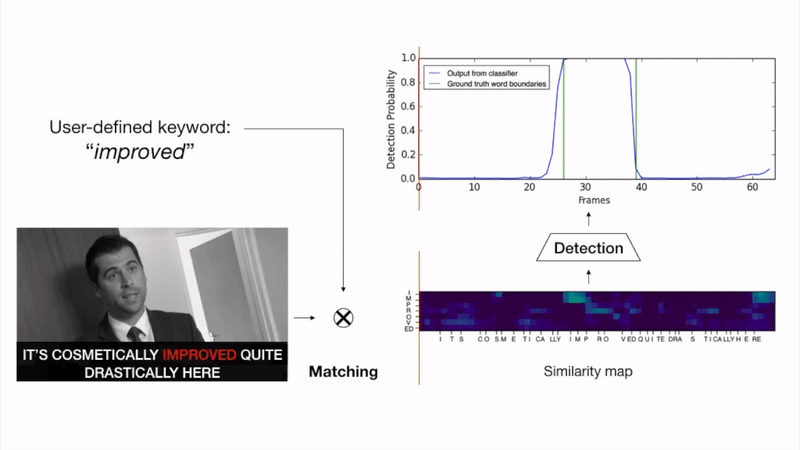

# Seeing Wake Words: Audio-visual Keyword Spotting
This repository contains code for training and evaluating the best performing visual keyword spotting model described in the paper [Liliane Momeni](http://www.robots.ox.ac.uk/~liliane/), [Triantafyllos Afouras](http://www.robots.ox.ac.uk/~afourast/), [Themos Stafylakis](http://github.com/tstafylakis), [Samuel Albanie](http://www.robots.ox.ac.uk/~albanie/) and [Andrew Zisserman](http://www.robots.ox.ac.uk/~az/),
*Seeing Wake Words: Audio-visual Keyword Spotting*, BMVC 2020. Two baseline keyword spotting models are also included.



[[Project page]](http://www.robots.ox.ac.uk/~vgg/research/kws-net/) [[Arxiv]](https://arxiv.org/abs/2009.01225) 


## Contents
* [1. Preparation](https://github.com/lilianemomeni/KWS-Net#1-preparation)
* [2. Training](https://github.com/lilianemomeni/KWS-Net#2-training)
* [3. Testing](https://github.com/lilianemomeni/KWS-Net#3-testing)
* [4. Demo](https://github.com/lilianemomeni/KWS-Net#3-demo)
* [Limitations](https://github.com/lilianemomeni/KWS-Net#limitations)
* [Citation](https://github.com/lilianemomeni/KWS-Net#citation)


## 1. Preparation

### 1.1. Dependencies

#### System 
* ffmpeg

#### Python 
* Torch
* NumPy

###### Optional for visualization
* Matplotlib
* TensorBoard

Install python dependencies by creating a new virtual environment and then running 

```
pip install -r requirements.txt
```

### 1.2. Datasets & Pre-processing

* Download [LRW](https://www.robots.ox.ac.uk/~vgg/data/lip_reading/lrw1.html) and [LRS2](https://www.robots.ox.ac.uk/~vgg/data/lip_reading/lrs2.html) audio-visual datasets for training; [LRS2](https://www.robots.ox.ac.uk/~vgg/data/lip_reading/lrs2.html) dataset for testing
* Save transcriptions and extract talking faces from clips using [metadata](https://www.robots.ox.ac.uk/~vgg/data/lip_reading/) available
* Pre-compute features for clips of talking faces using pre-trained [lip reading model](https://github.com/afourast/deep_lip_reading) and save LRS2 features at ```data/lrs2/features/main``` (train, val & test splits)  and ```data/lrs2/features/pretrain``` (pre-train split) and LRW features at ```data/lrw/features/main``` (train & val splits). Note we train the rest of the network on these pre-computed features to accelerate training.
* Compute word-level timings for [LRS2](https://www.robots.ox.ac.uk/~vgg/data/lip_reading/lrs2.html) transcriptions using [Montreal Forced Aligner](https://montreal-forced-aligner.readthedocs.io/en/latest/). These annotations are used as extra supervision to improve keyword localisation but our model can also be used without (see no LOC ablation in paper).
* Download [CMU phonetic dictionary](https://github.com/cmusphinx/cmudict): ```data/vocab/cmudict.dict```
* Build CMU phoneme and grapheme vocabulary files: ```data/vocab/phoneme_field_vocab.json``` and ```data/vocab/grapheme_field_vocab.json```
* Build dataset split json files: ```data/lrs2/DsplitsLRS2.json``` and ```data/lrw/DsplitsLRW.json``` using ```misc/data_splits_lrs2.py``` and ```misc/data_splits_lrw.py``` respectively 
* Keyword vocabularies: for both training and evaluation, we use only keywords pronounced with np > 5 phonemes. Moreover, as we want to evaluate on unseen keywords, we ensure that training and testing are performed on disjoint keyword vocabularies. To that end, we use all the words appearing in the LRS2 test set with np > 5 phonemes as evaluation keywords ``` data/lrs2/LRS2_test_words.json``` and we remove them from the training vocabulary, i.e. those words are not used in training the keyword encoder. For example, for the LRW dataset, the 500 word training vocabulary is reduced to ```data/lrw/LRW_train_words.json ```.

**TODO: ```misc/data_splits_lrs2.py``` and ```misc/data_splits_lrw.py```**


### 1.3. Pre-trained models

Download the pre-trained models by running

```
./download_models.sh
```
We provide several pre-trained models used in the paper:

* [Stafylakis & Tzimiropoulos G2P](https://arxiv.org/pdf/1807.08469.pdf) implementation: G2P_baseline.pth
* Stafylakis & Tzimiropoulos P2G, a variant of the above model where the grapheme-to-phoneme keyword encoder-decoder has been switched to a phoneme-to-grapheme architecture: P2G_baseline.pth
* KWS-Net, the novel convolutional architecture we propose: KWS_Net.pth

**TODO: make download_models.sh**

## 2. Training

TODO: explain two stages of training
We employ a curriculum training procedure for the rest of network that consists of two stages: (i) it is initially trained on the training set of LRW. As LRW contains clips of single words, here the model is trained without word time boundaries, (ii) the model is then fine-tuned on the sequence-level datasets.


TODO: show expected outputs

## 3. Testing
  
The performance of the models is evaluated on the test set of every dataset, using as queries all the held out test words (see datasets). We look for each query keyword in all the clips of the test set. Note that there is no balancing of positive and negative clips during evaluation: there are one or a few positive clips for a given keyword and the rest are negatives. During testing, in order to obtain fine-grained localisation, we apply the CNN classifier with a stride of one.

The performance is evaluated based on ranking metrics. For every keyword in the test vocabulary, we record the percentage of the total clips containing it that appear in the first N retrieved results, with N=[1,5,10], this is the ‘Recall at N’ (R@N). Note that, since several clips may contain a query word, the maximum R@1 is not 100%. The mean average precision (mAP) and equal error rate (EER) are also reported. For each keyword-clip pair, the match is considered correct if the keyword occurs in the clip and the maximum detection probability occurs between the ground truth keyword boundaries.

## 4. Demo

TODO: make demo with fun examples from video BMVC 2020

## Limitations
We would like to emphasise that this research represents a working progress towards achieving automatic visual keyword spotting, and as such, has a number of limitations that we are aware of (and likely many that we are not aware of). Key limitations are abilities to deal with:
* Homophemes - for example, the words "may", "pay", "bay" cannot be distinguished without audio as the visemes "m", "p", "b" visually look the same.
* Accents, speed of speech and mumbling which modify lip movements.
* Variable imaging conditions such as lighting, motion and resolution which modiy the appearance of the lips.
* Shorter keywords which are harder to visually spot.

## Citation
If you use this code, please cite the following:
```
@misc{momeni2020seeing,
    title={Seeing wake words: Audio-visual Keyword Spotting},
    author={Liliane Momeni and Triantafyllos Afouras and Themos Stafylakis and Samuel Albanie and Andrew Zisserman},
    year={2020},
    eprint={2009.01225},
    archivePrefix={arXiv},
    primaryClass={cs.CV}
}
